# Bundle Gen

Ứng dụng Next.js để:

- đọc danh sách bundle từ `CSV` hoặc `text`
- tìm ảnh tham chiếu theo SKU trong Google Drive
- ghép nhiều SKU thành 1 ảnh bundle bằng Gemini
- upload ảnh kết quả lên thư mục output trên Google Drive
- dọn các thư mục output bị trùng tên khi cần
## Engineering highlights

This project demonstrates:

- API integration with Google Drive and Gemini image generation
- batch processing for multiple product bundles
- parsing semi-structured CSV/text input into structured bundle records
- reference-image selection logic using SKU-based Drive folder matching
- round-robin image selection to improve product coverage
- streamed NDJSON progress updates for long-running generation jobs
- environment-based configuration for local/dev/production use
- fallback and error handling for missing folders, missing images, duplicate SKU folders, and generation failures
- public-safe configuration using `.env.example` and excluded credentials
## System design overview

```mermaid
flowchart LR
    A[CSV or text bundle input] --> B[Parse bundle rows]
    B --> C[Extract bundle name, master SKU, and component SKUs]
    C --> D[Resolve matching SKU folders in Google Drive]
    D --> E[Retrieve candidate product images]
    E --> F[Render reference images in the UI]
    F --> G[User selects reference images]
    G --> H[User optionally adds image-specific comments]
    H --> I[Build Gemini generation request]
    I --> J[Generate bundle images]
    J --> K[Upload outputs to Google Drive]
    K --> L[Review generated images]
    L --> M{Accept result?}
    M -- Rerun --> G
    M -- Commit --> N[Keep final bundle output]
```


## 1. Mục đích

Công cụ này dành cho team cần tạo ảnh bundle từ nhiều sản phẩm có sẵn ảnh trong Google Drive.

Luồng chính:

1. Người dùng nhập danh sách bundle.
2. Hệ thống tìm thư mục ảnh của từng SKU trong Drive.
3. Hệ thống lấy ảnh tham chiếu từ các SKU.
4. Gemini tạo ra 1 hoặc 2 ảnh bundle.
5. Ảnh mới được upload vào thư mục output trên Drive.

## 2. Yêu cầu

- Node.js 20+ khuyến nghị
- npm
- Google Drive có quyền đọc thư mục SKU và ghi vào thư mục output
- Google AI Studio API key cho Gemini image generation

## 3. Cài đặt

```bash
npm install
```

Tạo file `.env.local` từ `.env.example`.

Ví dụ:

```env
GOOGLE_SERVICE_ACCOUNT_PATH=./service_account.json
PARENT_FOLDER_ID=
OUTPUT_FOLDER_ID=
GEMINI_API_KEY=
```

## 4. Cấu hình môi trường

### Google Drive auth

Có 2 cách:

#### Cách 1: Service Account

```env
GOOGLE_SERVICE_ACCOUNT_PATH=./service_account.json
```

Sau đó share cả thư mục:

- thư mục cha chứa SKU (`PARENT_FOLDER_ID`)
- thư mục output (`OUTPUT_FOLDER_ID`)

cho email của service account.

#### Cách 2: OAuth

```env
GOOGLE_OAUTH_CLIENT_ID=
GOOGLE_OAUTH_CLIENT_SECRET=
GOOGLE_OAUTH_REDIRECT_URI=http://localhost:3000/api/auth/google/callback
GOOGLE_OAUTH_TOKEN_PATH=./.tokens/google-oauth.json
```

Sau khi chạy app, mở:

```text
/api/auth/google
```

để đăng nhập và cấp quyền.

### Folder ID

Có thể cấu hình sẵn trong `.env.local`:

```env
PARENT_FOLDER_ID=
OUTPUT_FOLDER_ID=
```

hoặc nhập trực tiếp trên giao diện web.

### Gemini

```env
GEMINI_API_KEY=
```

Các biến tùy chọn:

```env
GEMINI_IMAGE_MODEL=gemini-2.5-flash-image
GEMINI_IMAGES_PER_BUNDLE=2
GEMINI_MAX_REFERENCE_IMAGES=12
GEMINI_MS_BETWEEN_GENERATIONS=800
GEMINI_MAX_RETRIES=4
GEMINI_RETRY_BASE_MS=2000
GEMINI_IMAGE_TEMPERATURE=0.45
GEMINI_IMAGE_PROMPT_INCLUDE_NAME=false
GEMINI_IMAGE_PROMPT_INCLUDE_DESCRIPTION=true
BUNDLE_IMAGES_PER_DUPLICATE_SKU_FOLDER=2
PARENT_FOLDER_FALLBACK_ID=1JJ9RC7rDbbMN3jryfpquem0Xu9DEppMy
```

Ý nghĩa nhanh:

- `GEMINI_IMAGES_PER_BUNDLE`: số ảnh tạo ra cho mỗi bundle, hiện tối đa thực tế là 2
- `GEMINI_MAX_REFERENCE_IMAGES`: số ảnh tham chiếu tối đa gửi vào Gemini
- `GEMINI_IMAGE_TEMPERATURE`: giảm xuống nếu kết quả bị bịa thêm vật thể hoặc bố cục quá lung tung
- `BUNDLE_IMAGES_PER_DUPLICATE_SKU_FOLDER`: nếu 1 SKU khớp nhiều folder, lấy tối đa bao nhiêu ảnh mỗi folder
- `PARENT_FOLDER_FALLBACK_ID`: thư mục cha dự phòng nếu không tìm thấy SKU trong thư mục cha chính

## 5. Chạy project

Môi trường dev:

```bash
npm run dev
```

Build production:

```bash
npm run build
```

Chạy production:

```bash
npm run start
```

Mặc định mở trình duyệt tại:

```text
http://localhost:3000
```

## 6. Cách dùng trên giao diện

Trang chính có các phần:

- ô nhập bundle
- ô `Parent folder ID`
- ô `Output folder ID`
- nút `Generate bundles`
- nút `Clean duplicate output folders`
- thanh tiến độ theo bundle

### Tạo bundle

1. Dán dữ liệu `CSV` hoặc `text` vào ô nhập.
2. Nhập `Parent folder ID` và `Output folder ID` nếu chưa để trong `.env.local`.
3. Nhấn `Generate bundles`.
4. Theo dõi thanh tiến độ.
5. Xem kết quả từng bundle ở phần `Results`.

### Dọn thư mục trùng

1. Điền `Output folder ID` hoặc cấu hình `OUTPUT_FOLDER_ID`.
2. Nhấn `Clean duplicate output folders`.
3. Hệ thống sẽ move các folder dư vào Drive trash.

Quy tắc dọn trùng:

- ưu tiên xóa folder trống
- nếu nhiều folder cùng tên đều có dữ liệu, giữ folder mới nhất
- các folder còn lại bị chuyển vào thùng rác Drive, không xóa vĩnh viễn ngay

## 7. Input được hỗ trợ

### Dạng CSV

Cần có header:

- `name`
- `SKU`
- `description` là tùy chọn

Ví dụ:

```csv
name,SKU,description
Bộ mùa đông,ABC-1 DEF-2,"Tông ấm, chụp nhẹ nhàng"
Bộ vận động,TOP-9 HAT-3 BAG-1,"Lifestyle shot"
```

Trong đó:

- `name`: tên bundle để hiển thị / gợi ý ngữ cảnh
- `SKU`: SKU master trước, các SKU component theo sau
- `description`: mô tả thêm cho prompt, có thể bật/tắt trong env

### Dạng text

Ví dụ:

```text
Summer Kit | SHIRT-9 HAT-3
Gift Set: TOY-1 BOOK-2 BAG-7
ABC-1 DEF-2
```

Hỗ trợ:

- `Tên bundle | SKU1 SKU2 SKU3`
- `Tên bundle: SKU1 SKU2 SKU3`
- chỉ SKU: `SKU1 SKU2 SKU3`

Quy ước:

- SKU đầu tiên là `master`
- các SKU phía sau là `component`
- mỗi dòng phải có ít nhất 2 SKU

## 8. Quy tắc tìm folder SKU trên Drive

App tìm trong các folder con trực tiếp của `PARENT_FOLDER_ID`.

Một folder được coi là khớp SKU khi:

- từ đầu tiên của tên folder đúng bằng SKU
- với SKU toàn số, token thứ hai không được là một số khác

Ví dụ hợp lệ:

- `123 product photos`
- `ABC-1 Wooden Toy`

Ví dụ không hợp lệ:

- `1234 product photos` không khớp SKU `123`
- `123 023 name` không khớp SKU `123`

### Nếu 1 SKU khớp nhiều folder

Ví dụ:

```text
607 Qtoys Marble Run
607 Qtoys Marble Run ( 41x23 cm )
```

Khi đó app sẽ:

- gộp tất cả folder khớp của SKU đó
- mặc định lấy tối đa `2` ảnh từ mỗi folder
- trộn chúng vào danh sách reference của SKU

Nếu không tìm thấy ở thư mục cha chính, app sẽ thử ở:

```text
PARENT_FOLDER_FALLBACK_ID
```

## 9. Logic ảnh tham chiếu

Hệ thống cố gắng để Gemini không chỉ nhìn ảnh của 1 sản phẩm.

Quy tắc hiện tại:

- mỗi sản phẩm trong bundle phải có ít nhất 1 ảnh tham chiếu
- thứ tự ảnh tham chiếu là kiểu `round-robin`
- nghĩa là lần lượt lấy từ `master`, rồi `component 1`, `component 2`, ... rồi quay lại vòng tiếp theo

Điều này giúp giảm tình trạng:

- model chỉ dùng 1 SKU
- model bỏ quên product chính
- bố cục bị lệch nặng về 1 sản phẩm

## 10. Output mong đợi

### Trên Google Drive

Mỗi bundle thành công sẽ tạo:

- 1 thư mục output mới
- bên trong là ảnh đã generate

Tên folder output:

- nếu có `name`: `{SKU1 SKU2 ...} {name}`
- nếu không có `name`: `{SKU1 SKU2 ...}_Bundle`

Tên file ảnh output:

```text
{masterSku}_1.jpg
{masterSku}_2.png
```

Ví dụ:

```text
ABC-1_1.png
ABC-1_2.png
```

### Trên giao diện

Kết quả mỗi dòng bundle sẽ hiển thị:

- tên folder output
- `outputFolderId`
- hoặc lỗi nếu bundle đó fail

Ngoài ra còn có:

- parse preview trước khi chạy
- progress bar theo số bundle đã xử lý

## 11. API hiện có

### `POST /api/bundle`

Dùng để generate bundle.

Body:

```json
{
  "text": "Summer Kit | SHIRT-9 HAT-3",
  "parentFolderId": "optional",
  "outputFolderId": "optional",
  "stream": true
}
```

Nếu `stream: true`, response trả về dạng `NDJSON` gồm:

- `meta`
- `progress`
- `result`
- `complete`
- `error`

Nếu không truyền `stream: true`, API trả JSON cuối cùng như bình thường.

### `POST /api/bundle/dedupe-output`

Dùng để dọn folder trùng trong output.

Body:

```json
{
  "outputFolderId": "optional"
}
```

Response ví dụ:

```json
{
  "trashedFolderIds": ["id_1", "id_2"]
}
```

## 12. Các lỗi thường gặp

### `Drive auth failed`

Kiểm tra:

- service account path đúng chưa
- file JSON có tồn tại không
- OAuth đã login chưa
- folder đã share đúng quyền chưa

### `No folder under primary (or backup) parent...`

Kiểm tra:

- SKU có đúng không
- tên folder Drive có bắt đầu bằng SKU không
- SKU có nằm ở thư mục cha chính hoặc thư mục fallback không

### `No image files in folder for SKU ...`

Kiểm tra:

- trong folder có file ảnh thật sự không
- mime type có phải image không
- Drive file có bị trash không

### Gemini tạo ảnh xấu hoặc thiếu sản phẩm

Thử:

- giảm `GEMINI_IMAGE_TEMPERATURE`
- giảm `GEMINI_IMAGES_PER_BUNDLE=1` để debug dễ hơn
- tăng `GEMINI_MAX_REFERENCE_IMAGES`
- kiểm tra ảnh nguồn của từng SKU có rõ ràng, nhất quán không

## 13. Gợi ý vận hành

- dùng folder SKU với tên ổn định, bắt đầu bằng SKU
- tránh để quá nhiều ảnh rác trong mỗi folder SKU
- nếu 1 SKU có nhiều folder tương tự, nên hợp nhất Drive khi có thể
- chạy nút `Clean duplicate output folders` định kỳ để giữ output gọn
- khi test prompt hoặc reference, nên để `GEMINI_IMAGES_PER_BUNDLE=1`

## 14. Ghi chú

- app hiện ưu tiên tạo ảnh bundle phong cách e-commerce / lifestyle sạch
- app cố giảm hallucination nhưng vẫn phụ thuộc chất lượng ảnh nguồn và model Gemini
- folder duplicate cleanup chỉ áp dụng cho thư mục con trực tiếp trong output folder
